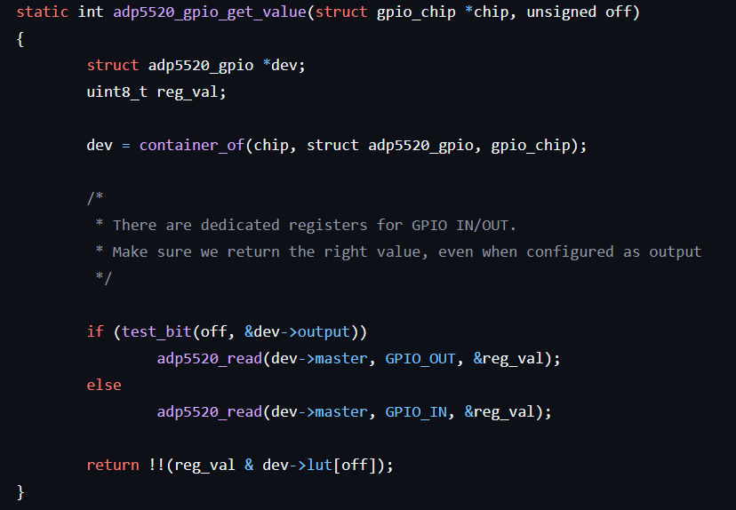

# GPIO driver Tutorial (Example ADP5520)

This document details how a GPIO driver is constructed for Linux. We will not go over GPIO pins that can handle IRQ as well in this tutorial.

I have used GPIO driver written for Analog Devices’ ADP5520 as a concrete example to follow along. Please find the driver source code in this folder. Data sheet for ADP5520 can be found at [https://www.analog.com/en/products/adp5520.html](https://www.analog.com/en/products/adp5520.html)

Even though this tutorial explains the driver written for ADP5520, the concepts of writing a GPIO driver here should stay common across different platforms. There will be differences that you would need to cater to whenever writing a GPIO driver for your platform of choice and the explanation of functions and structs below should indicate how to fulfill those platform specifications. 

**Note 1:** In the context of GPIO (General Purpose Input/Output), "offset" refers to the numerical position of a specific GPIO pin within a group of pins controlled by a single GPIO controller.

**Note 2:** Drivers are written as modules so that the kernel can access them closer to the hardware layer.

**Note 3 :** A bunch of lower layer functions have been provided by the device manufacturer in the form of source file and headers names `adp5520.c` and `adp5520.h` . This may not always be the case for your platform.

In order to build a GPIO driver for a Linux kernel interacting with these peripherals, the source file needs to have the following ingredients : 

- Structs
- Functions ( used by the struct defined above). These functions will be called when the kernel is interfacing with the hardware.

The above description may be reminiscent of a Class in C++. If you have experience with C++ OOP, this may be a good analogy. 

Now, we look at the kinds of structs actually used standardly are.

- **Struct#1** :  **`<device-name>_gpio`**. e.g. `adp5520_gpio`.
    - **Purpose :** It will contain all structures the above functions will need as parameters.
    - `struct device *master;`
        - This struct is part of the `adp5520_gpio` struct because when reading/writing to the buffers using functions in `adp5520.c` requires this datatype. The naming of this data type has been done according to the protocol  i2c that is being used by the adp5520 chip to interface. A quick glance into `adp5520.c` can tell us that.
    - `struct gpio_chip gc`
        - This structure is fetched from the following header  `<linux/gpio/driver.h>`. Use of `<linux/gpio.h>` has been deprecated for newer drivers.
        - It is supposed to abstract a GPIO controller.
    - `unsigned char lut[ADP5520_MAXGPIOS];`
        - serves as the bitmask for the GPIO pin used . “lut” is usually acronym for look up table. Since we are looking up values of a particular GPIO pin.
        - `ADP5520_MAXGPIOS` is defined in `/linux/mfd/adp5520.h`. Since `ADP5520_MAXGPIOS` is 8, a “char” which is 8 bits is enough for one-hot encoding.
    - `unsigned long output;`
        - This variable is used to keep track of which GPIO pins are outputs and which are inputs (indicated by 0 ).
        
- **Struct#2** :  **`static struct <type-of-driver>`** e.g.  **`**static struct platform_driver`
    - This type will be determined by the underlying protocol the GPIO is using.  Under the hood if we look into `adp5520.c` it uses a I2C protocol which is handled as a “platform_driver” type in Linux. In comparison, “langwell” (another platform) uses “pci_driver” type since for this chip GPIO block is exposed as a PCI device. As a third example, pl061 uses “amba_driver” which is a specific arm protocol.
    - The purpose of this struct is to register the correct probe() function , remove function and the details of the driver such as name and owner.
    - The name should be the same as what the “platform_device” uses in its name field
    

Now we move on to the functions needed that will make the hardware device come alive. The first two functions are standard kernel module functions.

- **`__init`**
    - In this function, you should call the corresponding register function to the type of underlying driver based on your platform’s protocol. The register function will need to be informed of the first struct we formed.
    - e.g. in our main example this is `platform_driver_register(&adp5520_gpio_driver)`. Similarly, it would be `amba_driver_register`and `pci_driver_register`for other devices.
- **`__exit`**
    - This function will be complementary (as in NOT) to the `__init function` . In this function we will call the unregister function.
    - e.g `platform_driver_unregister(&adp5520_gpio_driver);`
- **`get_value`**
    
    
    
    - **Input Args :** This function takes the gpio pin number and gpio_chip struct type as inputs.
    - First, we get the pointer to the adp5520_gpio housing the gpio_chip type member “chip”. This is achieved by `container_of()` MACRO in Linux.
    - Then, use the `adp5520_read` function specified in adp5520.c to read the value.
        - Since the input and output pins’ status is separated by the type of the pin, we have to check the corresponding register separately. This explains the if condition. The `test_bit(off, &dev->output)` function checks to see if the “offset” is an output type or not.
        - `adp5520_read(dev->master, GPIO_OUT, &reg_val);` The second argument is referring to ADP5520_GPIO_IN defined in the adp5520.h file. Looking at the datasheet we can tell that “I/Os configured as inputs store the digital state sensed at each
        pin in Register 0x19”. Hence ADP5520_GPIO_IN is defined as 0x19
        - The value is stored in reg_val. The standard way of returning the value from a GPIO pin is the following `!!(reg_val & dev->lut[off]);` Since the entire register is read that contains values for all other input/output pins we only need the value of the particular offset. The !! is to make sure you always get a 1 or 0. if x> 1 ⇒ 1 and you only get zero if x==0.
    
- **`set_value`**
    
    
    
    - First, we get the pointer to the  `adp5520_gpio` housing the gpio_chip type member “chip”.
    - Set the corresponding bit using : `adp5520_set_bits(dev->master, GPIO_OUT, dev->lut[off]);`
        - We can/should only set values on output configured GPIO pins.
    - `adp5520_clr_bits(dev->master, GPIO_OUT, dev->lut[off]);` if the `val` is not >1 or in this case it is 0.
- **`direction_input`**
    
    
    
    - The register called GPIO_CFG_2 controls which pins act as input and output. If the corresponding bit at this register is 0, that implies the pin is an input pin.
    - `clear_bit(off, &dev->output);` is to keep internal track of the input and output at each offset so that each access is proper when reading values. We did this in test_bit.
- **`direction_output`**
    
    
    
    - direction_output functions usually have an output value that you would want to set the pin after output directionality has been configured.
    - I am not sure why we would set the register GPIO_CFG_2 after setting the bit as shown in this example.
- **`probe`**
    - This an important function for a driver. Since this function was lengthy please refer to `adp5520-gpio.c` for the code.
    - The purpose of a probe function is to help the device get attached to the appropriate driver.